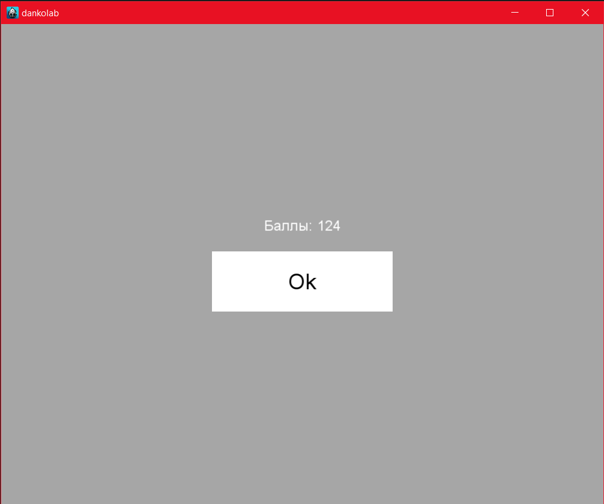

# Dankolab

Для компиляция и запуска проекта на windows прописать из папки проекта<br>
```cocos -s . -p win32 [-m debug|release]```

Проект выполнен на cocos2d-x 3v.

В папке bin/release лежит заранее скомпилированный проект для windows.

+ Размер проектного решения 1000 на 800(5:4).
+ Максимальная ширина и высота 32. Максимальное кол-во цветов 9.
+ Максимальный размер игрового поля 60% от экрана.
+ При вводе некорректорого значения ширины, высоты или цвета соответствующее поле будет заменено значением по умолчанию.
+ При удалении блока издаётся звук 'plamb.mp3'.
+ При удалении блока, блоки выше падают 0.5 сек, скорость зависит от кол-ва отсутствующих блоков ниже.
+ При удалении блока, блок увеличивается на 50% от своего размера и удаляется через 0.25 сек.
+ Если после хода игрока не осталось больше ходов, выводися окно завершения игры с выводом кол-ва очков(уничноженных блоков) и кнопки 'Ok', при нажатии на которую возвращает в игру.


